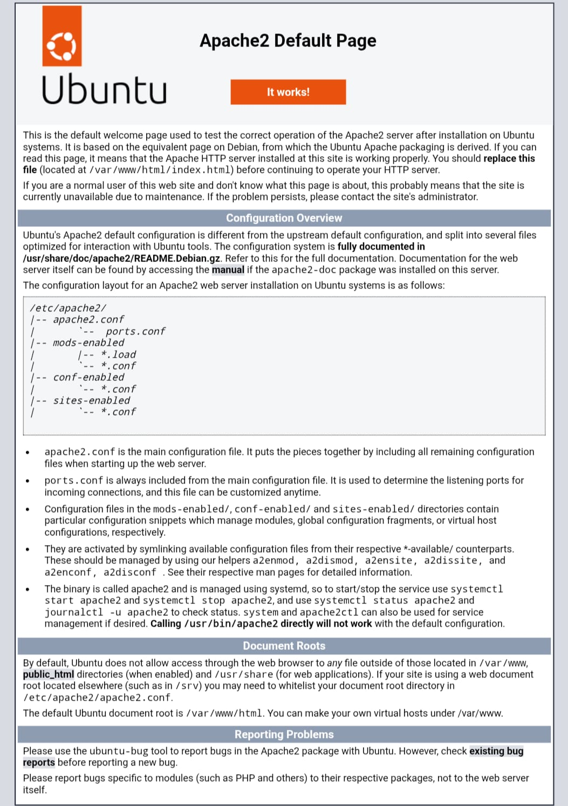

# Azure Cloud Computing & Infrastructure Portfolio

**Student Name:** Jashika Sahu  
**Platform:** Microsoft Azure  
**Domain:** Cloud Infrastructure & Architecture

---

## 📂 Project 1: Azure Virtual Machine Deployment & Web Hosting

### 📌 Objective
To deploy a Linux Virtual Machine (Ubuntu) on Microsoft Azure, access it securely using SSH keys, configure an Apache Web Server, and host a custom HTML website accessible via a public IP address.

### 🛠️ Infrastructure Blueprint
* **Resource Group:** `RG-Practice-VM`
* **VM Name:** `PracticeVM`
* **Region:** `Central India`
* **Image:** `Ubuntu Linux 24.04 LTS`
* **Inbound Ports Allowed:** `SSH (22)`, `HTTP (80)`
* **Public IP Address:** `20.xxx.xx.xx` *(Masked for Security)*

### 🚀 Step-by-Step Implementation

1. **Resource Group Creation:** Logged into the Microsoft Azure Portal and provisioned a new resource group named `RG-Practice-VM` in the Central India region.
2. **Virtual Machine Provisioning:** Deployed an Ubuntu Linux Virtual Machine instance configured with SSH Key Pair authentication for enhanced root security.
3. **Network Security Group (NSG) Configuration:** Configured inbound security rules to allow traffic through Port 80 (HTTP) for public web access and Port 22 (SSH) for secure remote management.
4. **Server Access & Configuration:** Secured the private key file (`.pem`) and established a remote terminal connection to the cloud instance using the following commands:
   ```bash
   chmod 400 PracticeVM_key.pem
   ssh -i PracticeVM_key.pem azureuser@20.xxx.xx.xx
5. **Apache Web Server Deployment:** Initialized, updated, and activated the Apache HTTP server components within the Linux environment:
   ```bash
   sudo apt update
   sudo apt install apache2 -y
   sudo systemctl start apache2
   sudo systemctl enable apache2
6. **Website Hosting:** Validated successful public web hosting by accessing the cloud instance's Public IP address and verifying the Apache welcome landing page.

---

## 📂 Project 2: High Availability Architecture Using Azure Availability Sets

### 📌 Objective
To design and implement a highly resilient and available cloud infrastructure using Azure Availability Sets, integrate virtual machine instances, automate server initialization via startup scripts (User Data), handle security maintenance, and perform vertical resource scaling.

### 🛠️ Key Architectural Components
* **Availability Set Name:** `MyAS`
* **Fault Domains:** `2` *(Hardware failure protection across racks)*
* **Update Domains:** `5` *(Scheduled maintenance downtime protection)*
* **Instance Size:** `Standard_B1s`
* **Subscription ID:** `772ad338-xxxx-xxxx-xxxx-xxxxxxxxxxxx` *(Masked for Security)*

### 🚀 Step-by-Step Implementation

1. **Availability Set (AS) Configuration:** Provisioned an Availability Set named `MyAS` on the Microsoft Azure Portal to eliminate single-points-of-failures and satisfy enterprise uptime SLA standards.
2. **VM Integration:** Deployed the active virtual machine instance under the constraints of the configured availability domain structure, ensuring physical isolation across data center hardware.
3. **Automated User Data Injection:** Injected custom bash startup/configuration scripts during the initial provisioning phase to automate software deployment tasks upon the first boot of the server.
4. **Security & Administrative Control:** Executed and validated administrative operations by leveraging Azure's built-in security features to test password reset mechanisms on the active deployment.
5. **Vertical Scaling (Instance Resizing):** Demonstrated infrastructure flexibility and scaling techniques by modifying the compute capacity and tier of the running instance dynamically to accommodate changing production workloads.

---

### 📸 Project Deployment Proof


---

---

## 📂 Project 3: Production VM Image Customization, Automated Provisioning & Cross-Region Replication

### 📌 Objective
To architect an enterprise-grade image deployment pipeline by configuring a baseline Ubuntu Server with automated web nodes, capturing a specialized custom platform image via Azure Compute Gallery, dynamically launching cloned instances, and establishing cross-region replication for disaster recovery (DR) resiliency.

### 🛠️ Key Architectural Components
* **Compute Gallery Asset:** `gallery1/img1/0.0.1`
* **Image Capture Profile:** `Specialized State` (Preserves underlying cryptographic settings & dependencies)
* **Automation Mechanism:** `Cloud-Init / User Data Shell Scripting`
* **Source Datacenter:** `Central India`
* **Target DR Location:** `Malaysia East (Asia Pacific)`
* **Validated Edge Gateways:**
  * Baseline Node Public IP: `135.235.217.182`
  * Cloned Image Node Public IP: `40.81.232.61`
  * Replicated Zone Node Public IP: `20.17.99.82`

### 🚀 Step-by-Step Implementation

1. **Automated Provisioning Setup:** Initialized an enterprise Linux environment using the `Create Virtual Machine` wizard. Provisioned standard compute specs, enabled the automated **User Data Injection** layer under the advanced parameters, and mapped a custom bash bootstrap process to execute a zero-touch Apache HTTP setup (`apache2`):
```bash
   #!/bin/bash
   sudo apt-get update -y
   sudo apt-get install apache2 -y
   sudo systemctl start apache2
   sudo systemctl enable apache2
   echo "<h1>Azure Web Server - Apache Deployed Successfully via User Data</h1>" | sudo tee /var/www/html/index.html
```
2. **Specialized Image Capture Sequence:** Stopped and safely deallocated the operational server node to guarantee data integrity. Initiated the **Azure Platform Capture Pipeline**, configuring a specialized template engine definition inside the managed repository to lock down the exact state of the environment.
3. **Template Validation & Node Cloning:** Queried the active Azure Compute Gallery, target-selected version `0.0.1`, and directly instantiated a decoupled cloned virtual machine node (`CreateVm-img1-20260529011104`). The instance dynamically provisioned without manual configuration, confirming structural deployment compliance.
4. **Endpoint Compliance Check:** Extracted the networking gateway public address (`40.81.232.61`) from the clone node. Executed HTTP browser queries and validated that the web endpoints were running natively right out-of-the-box.
5. **Cross-Region Replication & Sync:** Selected the custom gallery image profile and triggered the **Update Replication Architecture Engine**. Formally mapped **Malaysia East** as a secondary target region, executed multi-zone background sync tasks, and successfully validated a running edge instance isolated inside the Asia Pacific zone (`20.17.99.82`).

## 📁 Project Source Documents
* Detailed step-by-step screenshots and laboratory proofs are organized in the files below:
  * [Assignment 1 - VM & Web Hosting Docs](./Jashika_Sahu_Assignment1.pdf)
  * [Assignment 2 - Availability Sets Docs](./Jashika_Sahu_Assignment2.pdf)
  * [Assignment 3 - VM Image & Replication Docs](./Jashika_Sahu_Assignment3.pdf)
